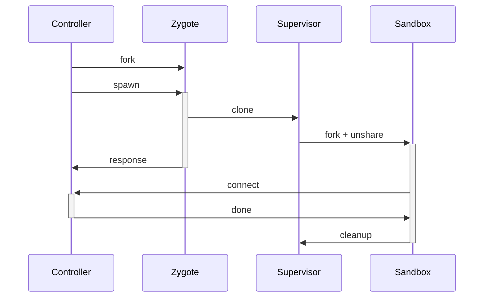

# Overview

The orchestration around this seems somewhat excessive, but there are a few reasons for it:

- We want the process of creating a sandbox to be as quick as possible.
- We want to be able to use shadow-utils (`newuidmap` and `newgidmap`) to create a root and builder user in each
  sandbox.
- We want to ensure that the sandbox is completely cleaned up no matter how it exits.
- It goes without saying that we want namespaces.

The speed of creating a sandbox is solved by using a [zygote][1]. It's simply created by making a fork very early on in
the parent's process lifetime. This process is then used as a template for any actual forks/clones that need to happen.
To keep things as minimal as possible, this process is not threaded (especially no tokio), and uses an extremely simple
and hardcoded protocol.

What I found was that there's a nasty catch-22 surrounding the chroot directory. If the "superuid" (e.g. 1000)
creates the directory, then the subuid won't have permissions to change it. If the subuid creates the directory then
the superuid won't be able to delete it. This is where the supervisor (which the zygote creates with a `clone`) comes
into play: it waits for the zygote to assign its subuid/subgid, creates the rootfs directory, and then immediately forks
to the sandbox process. All the supervisor does it wait around to be signaled, either by its parent (the zygote) or by
the child. When either happens it cleans up the rootfs. You can't give anything on the FS to another user in linux
without root, for security reasons - so that's not an option.

The rootfs is actually a tmpfs mount. This avoids having to traverse the chroot to unmount any child mounts prior to
deleting the directory: the supervisor can simply issue a lazy unmount, and then delete the directory (it remains as
root in the user namespace).

The supervisor gives the zygote time to apply the subuid/subgid by waiting for the controller side (listener) of the
unix socket to appear on the filesystem. Because the zygote RPC is a dead-simple request-response protocol, by the time
the controller receives the response the zygote is finished with the supervisor. Note that the supervisor doesn't
attempt to connect to the socket once it sees it: it has no need to.

[1]: https://chromium.googlesource.com/chromium/src/+/HEAD/docs/linux/zygote.md
